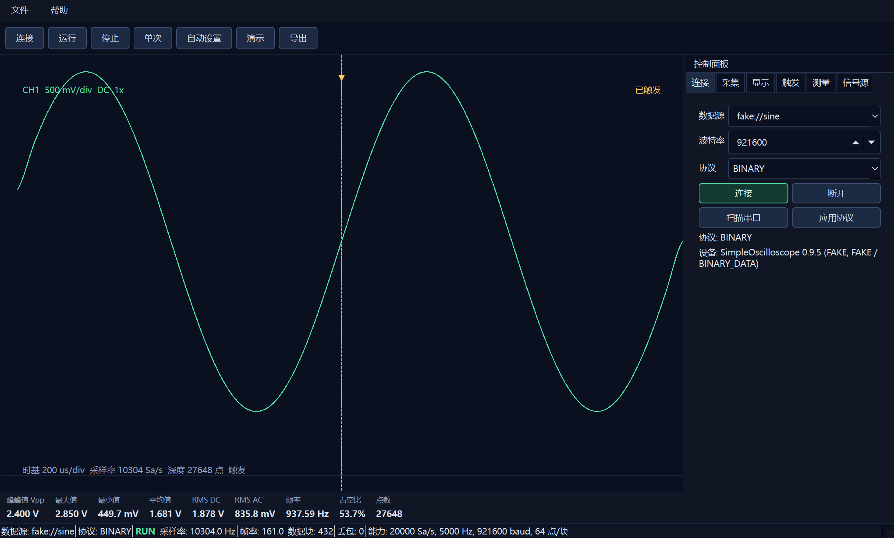

# SimpleOscilloscope

SimpleOscilloscope 是一个基于 `STM32F103C8T6` 的简易数字示波器项目，包含下位机固件、Windows 上位机和本地模拟器。项目面向课程设计和低速信号观察场景：STM32 负责 ADC 采样、串口传输和 PWM 测试信号输出，上位机负责连接设备、显示波形、测量基础参数并导出数据。

公开仓库：<https://github.com/Git-ys1/SimpleOscilloscope>

## 软件运行截图



## 项目组成

- `user/inc`、`user/src`：STM32F103C8T6 Keil 固件源码。
- `pc_app/scope_app`：PySide6 上位机源码，支持 CH340 串口、TCP 模拟器和 `fake://` 本地演示源。
- `simulator/mcu_simulator.py`：下位机协议模拟器，无硬件时可用于调试上位机。
- `docs`：用户指南、串口协议和上位机架构说明。
- `tools`：Keil 构建、烧录、Windows 打包和运行脚本。

## 主要功能

- 单通道 CH1 采样显示，默认 `20 kSa/s`，串口默认 `921600 baud`。
- 支持二进制采样块协议，兼容 ASCII 状态、能力和控制命令。
- 支持 Auto/Normal/Single 触发，波形居中稳定显示。
- 上位机显示 Vpp、最大值、最小值、平均值、RMS、频率、占空比和点数。
- 支持 `fake://sine` 演示源、TCP 模拟器和真实 CH340 串口。
- 支持 PyInstaller 便携版、portable zip 和 Inno Setup 安装包发布。

## 使用方法

### 普通用户运行上位机

从 Releases 下载最新版本：

- `SimpleScopePC-0.9.5-win64-portable.zip`：解压后运行 `SimpleScopePC.exe`。
- `SimpleScopePC-0.9.5-Setup.exe`：安装后从开始菜单启动。

无硬件演示：

```bat
SimpleScopePC.exe --source fake://sine --connect
```

连接真实硬件：

```bat
SimpleScopePC.exe --source COM14 --baud 921600 --connect
```

### 开发者源码运行

初始化 Python 环境：

```bat
tools\setup_pc_env.bat
```

运行上位机演示源：

```bat
tools\run_scope.bat --source fake://sine --connect
```

连接 TCP 下位机模拟器：

```bat
python simulator\mcu_simulator.py
tools\run_scope.bat --source tcp://127.0.0.1:8765 --connect
```

### 编译和烧录固件

编译 Keil 工程：

```bat
tools\build_keil.bat
```

生成固件：

```text
Objects\SimpleOscilloscope.hex
```

通过 ST-Link 和 STM32CubeProgrammer 烧录：

```bat
tools\flash_stlink.bat
```

### 打包 Windows 发布物

```bat
tools\build_portable.bat
tools\package_portable_zip.bat
tools\build_installer.bat
```

输出文件：

```text
dist\SimpleScopePC\SimpleScopePC.exe
dist\SimpleScopePC-0.9.5-win64-portable.zip
dist\installer\SimpleScopePC-0.9.5-Setup.exe
```

## 测试结果

V0.9.5 发布前完成以下验证：

| 项目 | 结果 |
| --- | --- |
| GitHub 仓库公开性 | Public |
| Python 单元测试 | `35 passed` |
| Keil 固件构建 | `0 Error(s), 0 Warning(s)` |
| Windows 便携版启动 | 通过 |
| Portable zip 启动 | 通过 |
| Inno Setup 安装包静默安装与启动 | 通过 |
| ST-Link 烧录 | 通过 |
| CH340/COM14 设备握手 | 识别 `SimpleOscilloscope 0.9.5`，采样率 `20000 Hz`，运行状态 `RUN` |

## 硬件说明

- MCU：`STM32F103C8T6`。
- ADC 输入：默认 `PA0 / ADC1_IN0`。
- PWM 测试输出：默认 `PA8 / TIM1_CH1`。
- 串口：默认 `USART1 PA9/PA10 @ 921600`。
- 烧录：ST-Link + STM32CubeProgrammer CLI。

## 安全限制

当前项目没有模拟前端保护和量程切换，ADC 输入仅允许 `0V ~ 3.3V`。禁止直接测量市电、高压、负压或未偏置的交流信号；超过范围的信号必须先经过分压、偏置、限流和钳位保护。

本项目当前为单通道、低速教学示波器，适合观察 1 kHz 等低速测试信号，不等同于商用示波器。
