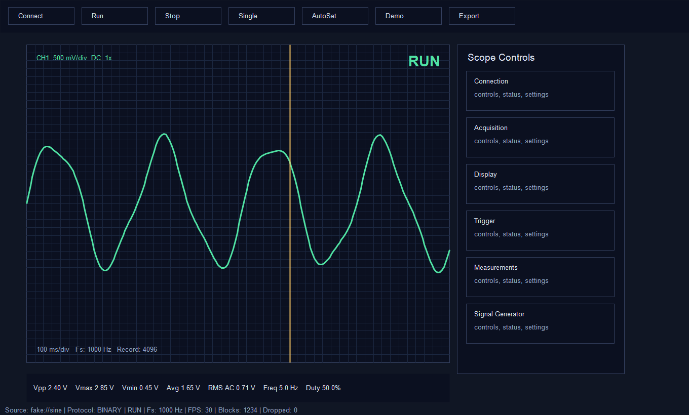

# SimpleOscilloscope

简易示波器/信号源项目，目标硬件为 `STM32F103C8T6` 最小系统板。v0.9.1 起，上位机进入 Windows 软件化发布线：支持 `simplescope-pc` GUI 命令、PyInstaller 便携版、portable zip、Inno Setup 安装包脚本和 GitHub Actions tag 构建。

- Keil 固件工程：STM32 通过串口默认输出二进制采样块，并在 `PA8/TIM1_CH1` 输出同一波形的 PWM 占空比版本。
- Python 上位机：`PySide6 + PyQtGraph + NumPy + pySerial` 模块化桌面应用，通过 CH340 串口、TCP 模拟器或 `fake://` 本地假数据源读取二进制/ASCII 采样帧并绘制波形。
- 下位机模拟器：用同一协议模拟单片机，方便没有板子时调试上位机。



## 下载安装版

普通用户推荐从 GitHub Releases 下载：

- `SimpleScopePC-x.y.z-win64-portable.zip`：便携版，解压后双击 `SimpleScopePC.exe`。
- `SimpleScopePC-x.y.z-Setup.exe`：安装版，安装后从开始菜单启动。

便携版和安装版都不要求用户预先安装 Python。

## 快速开始

开发者源码运行仍然可用。

初始化上位机本地 Python 3.11 环境：

```bat
tools\setup_pc_env.bat
```

安装本仓库为可编辑 Python 包，并生成 GUI 命令：

```bat
.venv\python.exe -m pip install -e .[dev]
simplescope-pc --source fake://sine --connect
```

没有硬件也能一键运行 Demo，上位机只推荐使用这一个入口：

```bat
tools\run_scope.bat --source fake://sine --connect
```

其中 `--source` 可以换成真实 CH340 串口，例如：

```bat
tools\run_scope.bat --source COM14 --baud 115200 --connect
```

如果需要连接 TCP 下位机模拟器，先另开一个终端启动模拟器，再把上位机 `--source` 改为 `tcp://127.0.0.1:8765`：

```bat
python simulator\mcu_simulator.py
tools\run_scope.bat --source tcp://127.0.0.1:8765 --connect
```

后续上位机会逐步整理成更像普通软件包的安装和启动方式；当前 README 不再推荐直接运行散落脚本。

编译固件：

```bat
tools\build_keil.bat
```

生成文件：

```text
Objects\SimpleOscilloscope.hex
```

烧录到 ST-Link 连接的板子：

```bat
tools\flash_stlink.bat
```

## 打包发布

构建 Windows 便携版：

```bat
tools\build_portable.bat
```

生成 portable zip：

```bat
tools\package_portable_zip.bat
```

生成 Inno Setup 安装包：

```bat
tools\build_installer.bat
```

输出文件：

```text
dist\SimpleScopePC\SimpleScopePC.exe
dist\SimpleScopePC-0.9.1-win64-portable.zip
dist\installer\SimpleScopePC-0.9.1-Setup.exe
```

`tools\build_installer.bat` 需要本机已安装 Inno Setup 6，并能找到 `ISCC.exe`。

## 固件结构

- `user/inc`：项目头文件。
- `user/src`：主程序、串口协议、波形发生器、板级初始化。
- `RTE/Device/STM32F103C8`：Keil/CMSIS 启动文件和系统时钟文件。
- `docs/protocol.md`：串口协议说明。

## 上位机结构

- `pc_app/scope_app/core`：采样模型、连接配置、NumPy 环形缓冲、单位格式化。
- `pc_app/scope_app/transport`：串口、TCP、`fake://` 本地数据源。
- `pc_app/scope_app/protocol`：ASCII 命令/状态解析、混合流解码，以及二进制采样块协议。
- `pc_app/scope_app/acquisition`：采集控制器、后台读取线程、接收统计。
- `pc_app/scope_app/processing`：测量、min-max 显示降采样、触发、处理链。
- `pc_app/scope_app/ui`：PySide6 主窗口 shell、PyQtGraph 波形屏幕、Dock 面板、测量栏、状态栏、安全提示。
- `packaging`：应用图标、Inno Setup 安装脚本。
- `.github/workflows/release-windows.yml`：tag 触发的 Windows portable zip 构建和 Release 资产上传。

数据流保持为：

```text
Transport -> Protocol Decoder -> Acquisition -> WaveformRingBuffer -> Processing -> UI
```

UI 不直接读串口、不直接解包二进制协议、不直接承担长计算。详见 `docs/pc_app_architecture.md`。

上位机当前支持时基、垂直档位、水平/垂直位置、暂停显示、清空缓冲、自动量程、CSV 导出，以及 `Auto/Normal/Single` 边沿触发。v0.8.0 起，主界面改为示波器式工作台，支持 `fake://sine`、`fake://square`、`fake://triangle`、`fake://noise`、`fake://mixed` 演示源，测量栏显示 Vpp、Vmax、Vmin、Avg、RMS DC、RMS AC、Freq 和 Duty。v0.9.1 起，普通用户可以下载 zip 或安装包运行，不需要安装 Python。

运行测试：

```bat
.venv\python.exe -m pytest -q
```

## 当前硬件假设

- MCU：STM32F103C8T6。
- ADC 输入：当前默认假设 `PA0 / ADC1_IN0`。
- 安全输入范围：`0V ~ 3.3V`。严禁直接测市电、高压、负压或超过 3.3V 的输入；超过范围或交流双极性信号必须先经过分压、偏置、限流和钳位保护。
- 调试/烧录：ST-Link，STM32CubeProgrammer CLI 路径为 `F:\AcademicHub\STMicroelectronics\stm32cubeprogrammer\bin\STM32_Programmer_CLI.exe`。
- 串口：固件第一版使用 `USART1 PA9/PA10 @ 115200`。如果最小系统板上的 CH340 实际接到 `USART2 PA2/PA3`，需要在 `user/src/board.c` 和 `user/src/uart.c` 切换引脚和外设。

## 当前限制

- 当前是单通道 CH1。
- STM32F103C8T6 默认采样率上限仍有限，适合教学和低速信号观察。
- 当前没有模拟前端量程切换，不能直接测高压、负压、市电或未偏置的交流信号。
- 二进制协议已接入，但更高采样率、FFT、逻辑分析、协议解码和打包安装仍是后续路线。
